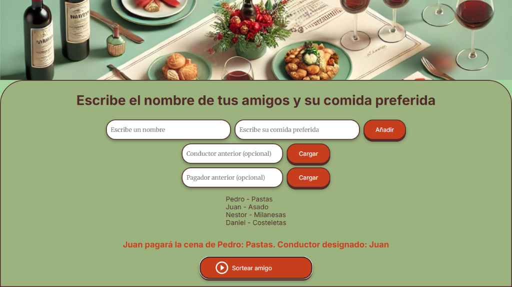

#Amigo beneficiado y designado🍽️🎁#

¡Bienvenidos a Amigo Secreto de la Cena! Un juego interactivo y divertido para decidir quién paga la cena, quien la recibe y quién conduce, todo con un toque de azar y justicia. 🎲✨ Perfecto para reuniones con amigos donde nadie quiere repetir roles hasta que todos hayan tenido su turno. 🚗💸
________________________________________
📖 Descripción
Este proyecto es una aplicación web que simula un sorteo tipo "amigo secreto" con un giro especial:
•	Pagador : Una persona paga la cena.
•	Beneficiario : Otra persona recibe la cena gratis.
•	Conductor designado : Alguien se encarga de conducir, asegurando que todos lleguen a casa sanos y salvos.
Lo mejor: ¡ningún pagador ni conductor se repite hasta que todos han cumplido su rol! 🔄 Esto garantiza equidad y diversión en cada ronda. 😊
________________________________________
🌟 Características
•	Registro de amigos : Añade nombres y comidas favoritas. 🍕🍔
•	Carga previa : Ingresa manualmente pagadores y conductores previos para evitar repeticiones desde el inicio. 📋
•	Sorteo justo : El algoritmo asegura que nadie pague o conduzca dos veces hasta que todos lo hayan hecho. ⚖️
•	Interfaz bonita: Diseño colorido y amigable con botones 3D y una imagen de portada que ocupa toda la pantalla. 🎨
•	Reinicio automático: Cuando todos han pagado o conducido, el ciclo se reinicia. ♻️
________________________________________
🛠️ Tecnologías usadas
•	HTML: Estructura de la página. 🏗️

•	CSS: Estilos personalizados con variables y efectos 3D en botones. 🎨

•	JavaScript: Lógica del sorteo y manejo dinámico de la lista de amigos. 🧠

•	Google Fonts: Fuentes Inter y Merriweather para un toque elegante. ✍️
________________________________________
📸 Capturas
•	Portada : 
 

•	Captura de pantalla del juego: 
 
________________________________________
🎮 Cómo jugar
1.	Añade amigos: 
o	Escribe el nombre de un amigo y su comida favorita en los campos superiores.
o	Haz clic en "Añadir". 🖱️
2.	Carga previa (opcional) : 
o	Si alguien ya pagó o conducido antes, ingrésalo en "Pagador anterior" o "Conductor anterior" y haz clic en "Cargar". ⏮️
3.	Sorteo : 
o	Presiona el botón "Sortear amigo" (con el ícono de reproducción). 🎲
o	Verás quién paga, quién recibe la cena y quién conduce. 🚗🍽️💸
4.	Repite : 
o	Sigue sorteando; el sistema evita repeticiones hasta que todos hayan pagado y conducido. 🔄
